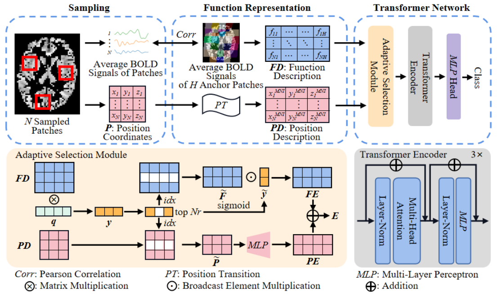

# Randomizing Human Brain Function Representation for Brain Disease Diagnosis

This is the PyTorch implementation for randomizing human brain function representation for brain disease diagnosis. 

## Abstract
We propose a novel randomizing strategy for generating brain function representation to facilitate neural disease diagnosis. 
Specifically, we randomly sample brain patches, thus avoiding ROI parcellations of the brain atlas. 
Then, we introduce a new brain function representation framework for the sampled patches. 
Each patch has its function description by referring to anchor patches, as well as the position description. 
Furthermore, we design an adaptive-selection-assisted Transformer network to optimize and integrate the function representations of all sampled patches within each
brain for neural disease diagnosis. 

## Framework


## Implementation 
The publicly available ABIDE dataset can be used to test our method. We focus on the
largest site (NYU) in ABIDE to avoid multi-site confounding.

## Usage: Installation

### Clone
```bash
git clone https://github.com/mjliu2020/RandomFR.git 
cd RandomFR
```
### Environment
```bash
conda env create -f RandomFRenv.yaml
conda activate RandomFRenv
```
- If you have any trouble installing PyTorch Geometric, please install PyG's dependencies manually.
- PYG's [FAQ](https://pytorch-geometric.readthedocs.io/en/latest/notes/installation.html#frequently-asked-questions) might be helpful.

## Usage: Data Preparation

### Download

- Download and put ABIDE dataset in `./Data_Preparation/`.

### Prepare Anchor Patches

```python
cd Data_Preparation
python 1.Create_Coordinate_ForAnchor_181217181.py
python 2.Create_AnchorRegion_WithGMmask_617361.py
```

### Randomly Sample Patches and Prepare Function Descriptions Together with Position Descriptions

```python
cd Data_Preparation
python 3.ClcFCMatrix_BasedRandomPatch_Anchor.py
```

## Usage: Classification

### Training

```python
cd Code
python NYU_train.py
```

## License 
The code is released under GPL License (see LICENSE file for details).